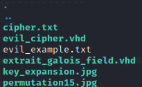
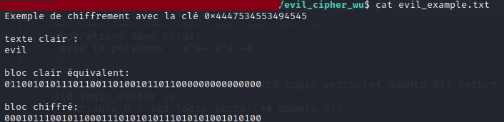
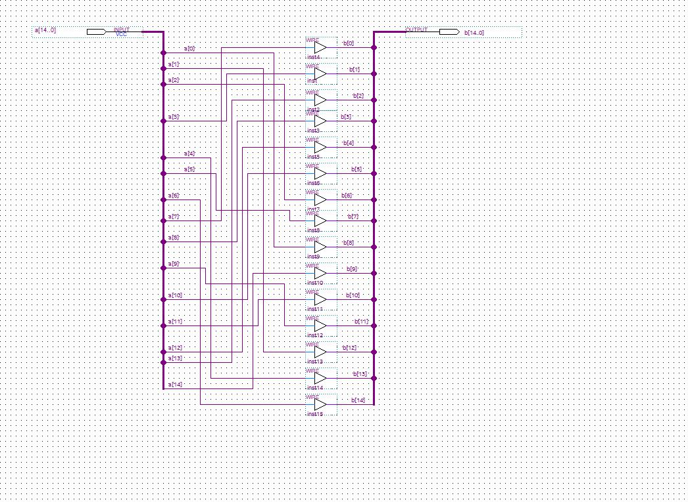
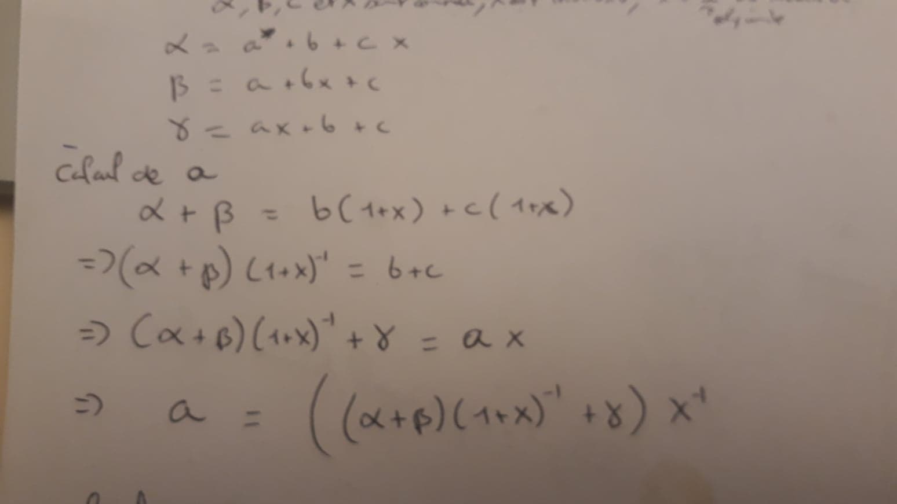
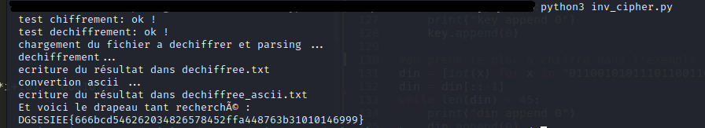

# Write-up "evil_cipher"”, hardware, Opération Brigitte Friang, DGSE, 2020

Voici mon write up pour "evil_cipher" un challenge proposé lors du ctf "Opération Brigitte Friang" par la DGSE et ESIEE.

C'est mon premier write-up, alors si il manque une explication n'hesitez pas à me prévenir à tom-pegeot@hotmail.fr


## Présentation du challenge
Tout d'abord le challenge viens avec l'énoncé suivant:
```
Evil Country a développé et implémenté sur FPGA son propre algorithme de chiffrement par blocs de 45 bits avec une clé de 64 bits. cipher.txt est un message chiffré avec la clé key=0x4447534553494545. Un agent a réussi à récupérer
- le code VHDL de l'algorithme (evil_cipher.vhd)
- la fin du package VHDL utilisé (extrait_galois_field.vhd)
- le schéma de la fonction permutation15 (permutation15.jpg)
- le schéma du composant key_expansion (key_expansion.jpg)

Un exemple de texte chiffré se trouve dans le fichier evil_example.txt (dans l'archive zip)

Déchiffrez le message.

Le flag est de la forme DGSESIEE{x} avec x un hash

evil_cipher.zip (SHA256=0b8ade55e61e2e0188cea2a3c004287ca16b9b1ee2951fa4ffe1b27963544434) : https://challengecybersec.fr/d3d2bf6b74ec26fdb57f76171c36c8fa/evil_cipher.zip
```
En somme il faut déchiffrer un fichier en aillant le code vhdl qui permet de systhetiser la puce de chiffrement.
Bonne nouvelle la clef est donnée !

## Exemple fournit

Alors c'est partit, on telecharge avec 'wget' pour ne pas utiliser la souris et faire plus pro. Dans l'archive fournit on trouve 6 fichiers.

<p align="center">
  
</p>

Puis on ouvre l'exemple:
<p align="center">
  
</p>

On a donc un exemple qui chiffre code 45 bits avec la même clef donnée dans l'énoncé. (à noter que le fichier à déchiffrer est égalemnt encodé avec des '0' et '1' ASCII)

Tout les autres fichier servent à décrire l'algorithme implémenté sur FPGA.


## Etude de l'algorithme

Tout d'abord on ouvre le fichier qui decrit la puce à la plus grande échelle. Ici après un rapide coup d'oeil on remarque qu'il s'agit de evil-ciher.vhd. (avoir déjà utilisé ou lut du vhdl peu aider ^^ )

<details>
<summary>Cliquer ici pour affichier le code de evil-cipher.vhd</summary>
<p>

```VHDL
library ieee;
use ieee.std_logic_1164.all;
use ieee.numeric_std.all;
use work.galois_field.all;

--------------------------------------------
-- Operations dans GF(32)
-- avec le polynome : X^5+ X^2 +1
--------------------------------------------

entity evil_cipher is
  port (
    clk    : in  std_logic;
    resetn : in  std_logic;
    start  : in  std_logic;
    key    : in  std_logic_vector(63 downto 0);
    din    : in  std_logic_vector(44 downto 0);
    dout   : out std_logic_vector(44 downto 0);
    ready  : out std_logic
  );
end entity;

architecture rtl of evil_cipher is
  type state is (idle, cipher);
  signal current_state : state;
  signal next_state    : state;
  signal reg_data      : std_logic_vector(din'range);
  signal rkey          : std_logicc_vector(din'range);
  signal ctr           : natural range 0 to 5;
  signal load          : std_logic;
  signal busy          : std_logic;

begin
 ready <= not busy;
 dout <= (others => '0') when busy = '1'
         else reg_data;

 process(clk,resetn) is
 begin
   if resetn = '0' then
     current_state <= idle;     
     reg_data <= (others => '0');
     ctr      <= 0;

   elsif rising_edge(clk) then
     -- state register
     current_state <= next_state;

     -- counter
     if busy = '0' or ctr=5 then
       ctr <= 0;
     else
       ctr <= ctr+1;
     end if;

     -- data register
     if busy = '1' then
       if ctr = 0 then
         reg_data <= rkey xor reg_data;
       else
          reg_data <= round(reg_data,rkey);
       end if;
     elsif load = '1' then
       reg_data <= din;
     end if;
   end if;
 end process;

 exp : entity work.key_expansion
   port map (
     resetn => resetn,
     clk    => clk,
     load   => load,
     key    => key,
     rkey   => rkey
   );

   process (current_state, start, ctr) is
   begin
     case current_state is
       when idle =>
         if start = '1' then
           next_state <= cipher;  
         else
           next_state <= idle;  
         end if;
         busy <= '0';
         load <= start;
       when cipher =>
         if ctr < 5 then
           next_state <= cipher;  
         else
           next_state <= idle;  
         end if;
         busy <= '1';
         load <= '0';        
     end case;
   end process;


end architecture;
```
</p>
</details>

Tout d'abord on regarde les entrés de la puces qui sont decrites dans l'entité `evil_cipher`.

```VHDL
entity evil_cipher is
  port (
    clk    : in  std_logic;
    resetn : in  std_logic;
    start  : in  std_logic;
    key    : in  std_logic_vector(63 downto 0);
    din    : in  std_logic_vector(44 downto 0);
    dout   : out std_logic_vector(44 downto 0);
    ready  : out std_logic
  );
end entity;
```


On y retrouve classiquement l'horloge `clk`, une entré pour `reset` la puce, une entrée `start` pour lancer le chiffrement, et `ready` qui doit probablement indiqué si la puce est prete ou bien si les données en sortie sont fixé (donc prete).
Mais les entrés qui nous interrese vraiment sont les 3 autres:
- `key` qui la clef qui est composé de 64 bits. Donc la clef donnée est de la bonne taille (ouf!)
- `din` et `dout` qui sont composé de 45 bits. Cela nous apprend que l'algorithme chiffre très certainement par bloc de 45 bits! ça tombe bien c'est exactemetn la taille des données chiffrées dans le fichier exemple.

puis en lisant le code on retrouve un process qui décrit l'état du système

```VHDL
process (current_state, start, ctr) is
begin
  case current_state is
    when idle =>
      if start = '1' then
        next_state <= cipher;  
      else
        next_state <= idle;  
      end if;
      busy <= '0';
      load <= start;
    when cipher =>
      if ctr < 5 then
        next_state <= cipher;  
      else
        next_state <= idle;  
      end if;
      busy <= '1';
      load <= '0';        
  end case;
end process;
```

Visiblement le site est donc dans un état d'attente `idle` puis passe à `cipher` lorsqu'il chiffre et s'arrete lorsque `ctr` atteindra 5.

En regardant l'autre process un peu plus haut dans le code on comprend que l'algorithme à un fonctionnement proche de l'AES avec un système de round. permettant de chiffrer les données entrés en `din`
on peux résumer ce process la en disant que:
- au début du chiffrement, `load` vaut 1 (cf l'autre process) et `busy` vaux 0, durant laquel `key` est chargé dans `key_expansion`. Et nos données à chiffrer dans `reg_data`.On s'y attardera plus tard. Après cette étape `load = 0` et `busy = 1`, le compteur ctr va donc commencer.
- puis 1 round `ctr = 0`, on prend une clef de 45 bits à partir d'une entité `key_expansion`  que l'on xor à notre `reg_data`.
- puis 5 tours `ctr = 1, ... , 5` ou on l'on applique la fonction `round` avec une clef donnée par `key_expansion`.
- On à fini les données sont chiffrés.

Pour inverser l'algorithme il nous faudra donc retrouver les clefs de 45 bits généré par `key_expansion`, inverser 5 fois round avec les clef 5,4,...,1 puis xor avec la clef 0.

## Generation des clefs en python.

D'apres ce que l'on a vu précedement, l'algorithme effectue 6 "rounds" avec des clefs de 45 bits, sachant que notre clef est de 65 bits il va falloir retrouver ces petites clefs.
Celles ci sont généré par `key_expansion` qui est décrit par ... une image ...
<p align="center">
  
</p>
On retrouve 64 registres. Graces au multiplexers Load permet de charger l'entré `key` de 65 bits dans les registres.
à chaque coup d'horloge les registres sont modifiés. Et les clefs de 45 bits que nous cherchons sont représentés par les 45 premiers registres.
à chaque tours d'horologe tout les registres prenent les valeurs des registres précédents sauf le registre 0 qui prend la valeur du 64 eme registre.
et 3 autres registre qui prennent des valeurs de xor entre le registre précédent et le dernier.

On peut donc recoder ce décalage de registre en python.

```python
def round_key(key):
	if(len(key)!=64):
		print("Error: taille de clef ne correspond pas dans al fonction round_key")
	key_tmp = 1*key
	#bidouillage mais les (1*) c'est pour avoir une copie profonde
  #on décale tout de 1
	key_tmp[1:] = 1*key[:-1]
  #le 1er prend la valeur du 64ème
	key_tmp[0] = 1*key[63]
  #les trois registre qui on des xors
	key_tmp[9] = key[8]^key[63]
	key_tmp[34] = key[33]^key[63]
	key_tmp[61] = key[60]^key[63]
	return key_tmp
```

puis on utilise cette fonction 5 fois pour avoir toutes les clefs. que l'on stoque dans une liste :

```python
def key_expansion(key):
	reg = 1*key
	keys = []
	for i in range(6):
		keys.append(1*reg[:45]) #les rkeys correspondes au 45 premiers registres
		reg = round_key(1*reg)
	return keys
```

**c'est bon on à toutes les clefs nécessaires !!**

## Inversion de la fonction round

Ensuite nous voulons inverser round, qui est écrite en vhdl dans `extrait_galois_field.vhdl`

<details>
<summary>Code vhdlcomplet pour la fonction round pour les curieux</summary>

```VHDL
--------------------------------------------
-- Operations dans GF(32)
-- avec le polynome : X^5+ X^2 +1
--------------------------------------------

  function permutation       (a : std_logic_vector(44 downto 0)) return  std_logic_vector is
    variable b : std_logic_vector(44 downto 0);
  begin
    b(14 downto  0) := permutation15(a(29 downto 15));
    b(29 downto 15) := permutation15(a(44 downto 30));
    b(44 downto 30) := permutation15(a(14 downto  0));
    return b;
  end permutation;

 function round (d : std_logic_vector(44 downto 0); key : std_logic_vector(44 downto 0)) return t_block is
   variable tmp  : std_logic_vector(44 downto 0);
   variable data : std_logic_vector(44 downto 0);
 begin
   tmp := permutation (d);   
   for i in 0 to 8 loop
      tmp(5*i+4 downto 5*i):= galois_inverse(tmp(5*i+4 downto 5*i));
   end loop;

   tmp := tmp xor key;

   for i in 0 to 2 loop
     data (15*i+4  downto 15*i   ) :=
       tmp (15*i+4  downto 15*i)   xor
       tmp (15*i+9  downto
       15*i+5) xor
       galois_multiplication(tmp(15*i+14  downto 15*i+10), "00010");

     data (15*i+9  downto 15*i+5 ) :=
       tmp (15*i+4  downto 15*i) xor
       galois_multiplication(tmp (15*i+9  downto 15*i+5), "00010") xor
       tmp (15*i+14  downto 15*i+10);     

     data (15*i+14  downto 15*i+10 ) :=
       galois_multiplication(tmp (15*i+4  downto 15*i), "00010") xor
       tmp (15*i+9  downto 15*i+5) xor
       tmp (15*i+14  downto 15*i+10);                                   
   end loop;

   return data;  
 end round;

end galois_field;
```
</details>

on peux résumer la fonction round en plusieurs étapes:
- une permutation sur le bloc d'entrée (qui utilise une fonction permutation15)
- on prend chaque groupe de 5 bits, que l'on inverse en le considérant dans GF32
- xor avec la clef de 45 bits (on les à récupéré précédement)
- On prend 3 groupes de 5 bits qui nous donnent 3 nouveau groupes de 5 bits grace à un système d'équation dans GF32

### La permutation
Donc étape 1, grâce à l'image qui décrit la permutation15 on peux la recoder en python, ainsi que la permutation inverse.
<p align="center">
  
</p>
Oui ça rappelle les jeux au dos des paquets de cereales ou il faut suivre une ligne...

```python
def permutation15(a):
	b = []
	ordre = [7,3,13,8,12,10,2,5,0,14,11,9,1,4,6]
	for i in ordre:
		b.append(a[i])
	return b

#la fonction inverse
def permutation15_inv(b):
	a = []
	ordre = [8,12,6,1,13,7,14,0,3,11,5,10,4,2,9]
	for i in ordre:
		a.append(b[i])
	return a
```
Avec ça on peux recoder la permutation complète décrite en vhdl:

```VHDL
function permutation       (a : std_logic_vector(44 downto 0)) return  std_logic_vector is
  variable b : std_logic_vector(44 downto 0);
begin
  b(14 downto  0) := permutation15(a(29 downto 15));
  b(29 downto 15) := permutation15(a(44 downto 30));
  b(44 downto 30) := permutation15(a(14 downto  0));
  return b;
end permutation;
```
qui donne en python:

```python
def permutation(a):
	b        = [0 for i in range(45)]
	b[:15]   = permutation15(a[15:30])
	b[15:30] = permutation15(a[30:45])
	b[30:45] = permutation15(a[0:15])
	return b
#fonction inverse
def permutation_inv(b):
	a        = [0 for i in range(45)]
	a[15:30] = permutation15_inv(b[:15])
	a[30:45] = permutation15_inv(b[15:30])
	a[0:15]  = permutation15_inv(b[30:45])
	return a
```

voila la première étape, ensuite pour inverser les groupes de 5 bits (donc polynome considéré dans GF32), on peux utiliser importer un fichier python codé par un certain Robert-Campbell (https://github.com/Robert-Campbell-256/Number-Theory-Python/blob/master/finitefield.py) qui implemente GFXXX de manière très propre et qui impléménte toute les opérations !
grâce a ce github on peux implémenter facilement la multiplication et l'inverse. (pour l'inverse de 0 apèrs un test sur le code fini j'ai trouvé qu'il fallait utiliser le polynome nulle comme ce que donne le code de Robert Campbell).
On Implémente le corp GF32 (avec le polynome X^5+ X^2 +1) comme indiqué dans le vhdl grâce à `GF32 = GF(2, [1,0,1,0,0])`
On peux donc inverser les groupes de 5 bits (cette fonction s'inverse tout seul donc super simple a déchiffrer =))

```python
#permet la conversion d'objet GF32 a nos liste de 0 et 1
def gf_to_list(gf):
	a = '{0:c}'.format(gf)
	l = [1*(x=='1') for x in a]
	while(len(l)<5): # normalement pas besoin mais pour etre sure on rajoute des bits si besoin
		print("Error: mauvaise taille de polynome ! (la librairie devrait mettres les 0")
		l.append(0)
	return l

def galois_inverse(a):
	gf_a = FiniteFieldElt(GF32,a) #on passe en objet dans GF32
	gf_b = gf_a.inv()
	if(gf_b * gf_a != FiniteFieldElt(GF32, [1,0,0,0,0])):
		return gf_to_list(gf_a) #arrive quand on demande l'inverse de 0
	return gf_to_list(gf_b) # on retransforme le resultat en liste de 0 et 1
```

maintenant il ne reste que le système qui se repete 3 fois (1 fois par groupe de 15 bits):

```vhdl
for i in 0 to 2 loop
  data (15*i+4  downto 15*i   ) :=
    tmp (15*i+4  downto 15*i)   xor
    tmp (15*i+9  downto
    15*i+5) xor
    galois_multiplication(tmp(15*i+14  downto 15*i+10), "00010");

  data (15*i+9  downto 15*i+5 ) :=
    tmp (15*i+4  downto 15*i) xor
    galois_multiplication(tmp (15*i+9  downto 15*i+5), "00010") xor
    tmp (15*i+14  downto 15*i+10);     

  data (15*i+14  downto 15*i+10 ) :=
    galois_multiplication(tmp (15*i+4  downto 15*i), "00010") xor
    tmp (15*i+9  downto 15*i+5) xor
    tmp (15*i+14  downto 15*i+10);                                   
end loop;
```

que l'on peux inverser en prenant un papier et un stylo et en n'oubliant pas que `x xor x = 0`.
Sur papier en appelant les groupe de 5 bits d'entrés `a`,`b` et `c` et ceux de sortie `alpha`, `beta`,`gamma` et `X` le polynome f(X) =X, (donc "00010" en binaire). Donc le calcul dans GF32 (le '+' etant xor):

<p align="center">
  
</p>

on trouve de la même façon `b` et `c` ce qui permet de finir de recoder round et son inverse en python.

```python

def xor(l1, l2):
	l = []
	for i in range(len(l1)):
		l.append(1*(l1[i]^l2[i]))
	return l

  def round(d, key):
  	tmp = [0 for i in range(45)]
  	data = [0 for i in range(45)]
  	tmp = permutation(d)
  	for i in range(9):
  		tmp[5*i: 5*i + 5] = galois_inverse(tmp[5*i:5*i+ 5])
  	tmp = xor(tmp, key)
  	for i in range(3):
  		# 5 premiers bits
  		data[15*i:15*i+5] = xor( xor( tmp[15*i:15*i+5], tmp[15*i+5:15*i+10]) , galois_multiplication(1*tmp[15*i+10:15*i+15]))
  		# 5 suivants
  		data[15*i+5:15*i+10] = xor( xor( tmp[15*i:15*i+5], galois_multiplication(1*tmp[15*i+5:15*i+10])) , tmp[15*i+10:15*i+15])
  		# 5 suivants
  		data[15*i+10:15*i+15] = xor( xor( galois_multiplication(1*tmp[15*i:15*i+5]), tmp[15*i+5:15*i+10]) , tmp[15*i+10:15*i+15])
  	return data

# grace au calcul papier...
def round_inv(data, key):
	tmp = [0 for i in range(45)]
	for i in range(3): #obtenu par
		tmp[15*i: 15*i+5] =  galois_div( xor(galois_div(xor(data[15*i: 15*i+5], data[15*i + 5: 15*i+10]), div = [1,1,0,0,0]),data[15*i+10: 15*i+15]) , div =[0,1,0,0,0])
		tmp[15*i+5: 15*i+10] =  galois_div( xor(galois_div(xor(data[15*i: 15*i+5], data[15*i + 10: 15*i+15]), div = [1,1,0,0,0]),data[15*i+5: 15*i+10]) , div =[0,1,0,0,0])
		tmp[15*i+10: 15*i+15] =  galois_div( xor(galois_div(xor(data[15*i+5: 15*i+10], data[15*i + 10: 15*i+15]), div = [1,1,0,0,0]),data[15*i: 15*i+5]) , div =[0,1,0,0,0])
	tmp = xor(tmp, key)
	for i in range(9):
		tmp[5*i: 5*i +5] = galois_inverse(tmp[5*i:5*i+ 5])
	d = permutation_inv(tmp)
	return d
```
c'est bon on a codé et inversé round ! il ne reste plus qu'a recoder la fonction principale qui lance les 5 rounds*

## Process principal en python

On traduit le process principale décrit plus haut lors de la lecture du premier vhdl.

Donc il nous faut code qui, genere les clef rkeys (déjà codé) => effectue un xor avec la première clef => la function round avec les 5 autres => sortie
Donc pour l'inverse on a déjà tout de pret aussi:
- Appeller notre générateur de clef pour recupérer les 6 `rkeys`
- Sur notre chiffree on applique l'inverse de round avec les `rkeys` 6,5...,1
- On xor avec `rkeys` 0
- on resort le résultat
et ceci permet de décoder un bloc!

le code correspondant:

```python
#la fonciton pour chiffrer
def evil_cipher(key, din):
	reg_data = [0 for i in range(45)]
	ctr  = 0
	#load
	rkeys = key_expansion(key)
	reg_data = 1*din
	# rounds
	for ctr in range(6):
		if(ctr == 0):
			reg_data = xor(1*rkeys[ctr], 1*reg_data)
		else:
			reg_data = round(1*reg_data, 1*rkeys[ctr])
	return reg_data

#la fonction pour déchiffrer
def evil_cipher_inv(key, dout):
	ctr = 0
	rkeys = key_expansion(key)
	reg_data = 1*dout
	for ctr in [5,4,3,2,1,0]:
		#print("".join([str(x) for x in reg_data]))
		if(ctr == 0):
			reg_data = xor(1*rkeys[ctr], 1*reg_data)
		else:
			reg_data = round_inv(1*reg_data, 1*rkeys[ctr])
	return reg_data
```

C'est bon on peux déchiffrer un bloc !

On charge donc la clef donnée dans notre script python (on inverse l'ordre des bits car dans mes listes le lsb est à l'indice 0).

## Test de notre Algorithme de chiffrement/déchiffrement

On a plus qu'a tester notre algorithme avec le code python qui charge la clef et les bloc d'exemple donnée dans le fichier `evil_example.txt`

```python

# on initialise la clef
key = [int(x) for x in "{:064b}".format(0x4447534553494545)]
key = key[::-1]
#on met les 1 necessaire a gauche pour fair 64 bits
while len(key) < 64:
	print("key append 0")
	key.append(0)

#on prend le bloc à chiffré dans l'exemple
din = [int(x) for x in "011001010111011001101001011011000000000000000"]
din = din[::-1]

#le bloc que l'on doit retrouver
dout = [int(x) for x in "000101110010110001110101010111010101001010100"]
dout = dout[::-1]


#on test de chiffrer
sortie = evil_cipher(key, din)
#on verifie que notre algorithme a fonctionné
if(sortie == dout):
	print("test chiffrement: ok !")

#on test de déchiffrer
dechiffre = evil_cipher_inv(key, sortie)

if(dechiffre == din):
	print("test dechiffrement: ok !")
```

on en profite déjà pour ecrire le code qui va aller chercher les données à déchiffrer dans `cipher.txt` si jamais sa marche du premier coup (evidement j'ai du corriger des détailles...)

```python

print("chargement du fichier a dechiffrer et parsing ...")

f = open("cipher.txt", "rb")
donnees_chiffrees = f.read()
f.close()
#on retire le '\n' inutile
donnees_chiffrees = donnees_chiffrees.replace(b"\n", b"")

# On lit les blocks de 45 bits dans le fichier
blocks = []
for i in range(len(donnees_chiffrees)//45):
	block = donnees_chiffrees[45*i: 45*(i+1)]
	block = block.decode('ascii')
	block = [int(i) for i in block]
	blocks.append(block)


#on déchiffre chaque bloc
print("dechiffrement...")

blocks_dechiffree = []
for block in blocks:
	block_dechiffree = evil_cipher_inv(key, block[::-1])[::-1]
	block_dechiffree ="".join([str(i) for i in block_dechiffree])
	blocks_dechiffree.append(block_dechiffree)

dechiffree = "".join(blocks_dechiffree)

print("ecriture du résultat dans dechiffree.txt")
f = open("dechiffree.txt", "w")
f.write(dechiffree)
f.close()

# conversion en ascii
print("convertion ascii ...")

def bin_to_ascii_char(a):
	return chr(int(a,2))

def bin_to_ascii(bin_str):
	str_cp = 1*bin_str
	if(len(str_cp)%8 != 8): #on ajuste pour avoir un multiple de 8 bits
		str_cp += "0"*(8-(len(str_cp)%8))
	result = ""
	for i in range(len(str_cp)//8):
		x = str_cp[i*8:(i+1)*8]
		result += bin_to_ascii_char(x)
	return result

dechiffree_ascii = bin_to_ascii("".join(blocks_dechiffree)))

print("ecriture du résultat dans dechiffree_ascii.txt")
f = open("dechiffree_ascii.txt", "w")
f.write(dechiffree_ascii)
f.close()

```

On lance le tout et ... tada !!

<p align="center">
  
</p>

on récupère le flag **DGSESIEE{666bcd546262034826578452ffa448763b31010146999}**

On peut donc valider ce challenge à 400 points. C'est le challenge qui vallait le plus de points (à égalité avec steganausorus).

pour ceux qui voudrait le code en entier le voici je le met disponible ici (https://pt0m.github.io/ressources/evil_cipher/inv_evil_cipher.py) *merci de laisser mon nom dessus si vous le partagez ;)*
