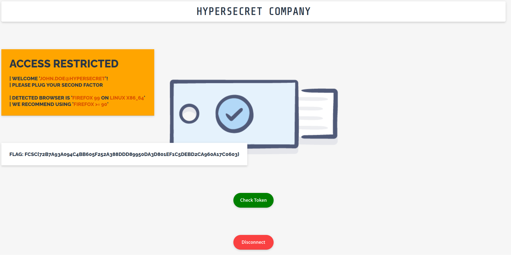
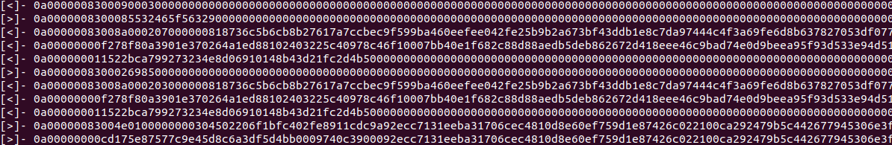
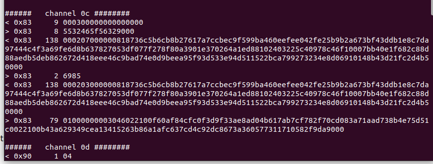

# write-up X-Factor 2 - FCSC2022

This document present my resolution process for the X-Factor challenge during the FCSC 2022 event.

# The challenge

This challenge put us into the skin a hacker trying to get sensitive information of a company. To do so, we have to use the remote access on the company website. Sadly user accounts are protected with a physical token 2nd factor authentification. But everything isn't over yet as the managed to sniff the communication with the biometric USB token!

**TLDR : Our goal is to find a way to log into the website protected with a biometric USB token.**

Another challenge is required to access this one but it won't be covered here. Therefore, we will assume we already know the username and password.

We are provided with a pcapng file containing data collected by the USB sniffer.

# Part 1: Analysis of the login page

Before analysing the pcapng file I wanted to know what I was searching for. Therefore, I first putted it aside and took a look at the website.

Once logged with the username and the password we get a page that ask us to insert the physical token and wait for us to push the button ""Check token" to authenticate. (Also thanks to the creators to put a indication on wich version of the navigator was required).



So I looked into the sourced and found out 2 interesting JavaScript files `login.js` and `u2f-api.js`.
The first one `login.js` is the one containing the function called by the button "Check token". Most of it doesn't interest us. So i disregarded most of it, like the functions that contain "Enroll" as we don't want to register a new token. This left us with two short functions:
- `beginAuthen` that perform a request at the `/beginAuthen` API for a challenge and send it to `u2f.sign` (in a second file) with a callback to `finishAuthen`. I also copy pasted a few responses of this /beginAuthen API for later and realised that it send me back only 3 possible challenges!
- `finishAuthen` that send the answer back to authenticate to the API `/finishAuthen`. Nothing interesting here for now.

To sum up this 2-factor authentification seemed to work with challenge that as to be signed with a cryptographical function related to the token.

I kept in mind those two function, as it was the one I planed to replace to bypass the use of the token. Then I looked into `u2f.sign()` in the second file. It obviously took the challenge at parameters and a callback to get the response. The rest of the file was a dead end as it the interesting part is built into the browser functions.

But I had what I was searching for! `u2f` was the first hint I had on how the token worked. A quick google search tell us that it stand for `universal 2nd factor`[1] and good for us: this seemed pretty well documented!


I sort out the documentation/info that interested me and found out that it was a pretty cool technology =).

I kept 3 tabs open:
- "FIDO U2F Raw Message Formats" explain how the challenge and authentification works.[2]
- "FIDO U2F HID Protocol" related to how it is implemented on USB (that's for us).[3]
- "FIDO U2F JavaScript API" for the exploit at the end. And also the google documentation of the API as the u2f-api.js contained a google licence on top. And a copy paste of it lead us to the github it came from.

With the documentation I was more than ready to move on to the pcap file !

# Part 2: Analysis of the pcapng

Here my intention is clear parsing the data quickly to be one of the first to solve the challenge.
That's where i opened wireshark and quickly realise that I would be much faster directly with python. As the parsing weren't good enough to solve it on sight. There were clearly multiple requests in the same tame to the USB Token at some point.

So I didn't waste more time and load that into python. I like scapy to do that =)
```python
from scapy.all import *
packets = rdpcap("capture_USB.pcapng")
# only keep the raw data
raw_p = [i.original for i in packets]
# i keep the only the RIB_ID, the byte that indicate the direction, and the u2f-hid data of each packet
cleaned_packet = [[r[:8], r[8], r[0x40:]] for r in raw_p]
```

From the first 64 bytes I only kept the first 8 as I though it would help me group them together and the 9th as it told me if the packet was a request to the token or a response.(I deduced from the wireshark parsing.).

From now on I only care from the bytes 64th till the end of each packet.
By printing a few packets, I realised that there was a pattern that repeat, and the 1st byte indicate which repetition it was. So I group the packets based on this byte. I also removed the packet starting with 0xffffffff as they seemed to only start a new group of packets (a token request).
After this quick cleanup each group of packets looked like this. The left sign gives me the direction of the communication (9th bytes of each packets)



It seems that data are split over multiple packet when too long so we can regroup them (with ctrl-f in the HID doc to find the byte telling how much data will be send and which bytes are containing actual data).

We now have clean data of the communication!

I only read the authentification part of the doc (Skipping registration etc ...). But that is enough to understand how it works:

- first the client send the handle (id) of the key to use and a sha256 of a encoded json containing:
  - `"typ":"navigator.id.getAssertion"` always the same for authentification
  - `"challenge":"L8tsCkDErRPzV9SAOlOj2JzFMXAOjmUs7JnimkH9_gI"` the challenge i saved from the first part
  - `"origin":"https://x-factor.france-cybersecurity-challenge.fr"`
  - a optional last parameters **that i know wasn't used here considering the size of the request to the token.**
- the token respond back with a counter with the number of times this key was used to authenticate and the signature (using eliptic curve).

With a little ctrl-f with the keyhandle I was able to find where everything was in the packets !

here is an exemple with the channel 0c:


## Part 3: The 2 flaws and the exploit

The u2f system isn't flawed by default. But a few things help us find exactly what we are expected to do in this challenge.

First I noticed in the first part that the challenge sent by the website can only take 3 possible values. Therefore, I expected it to be one of those when the token was sniffed. But that isn't enough to hack into the website. Indeed, a physical counter on the token helps the website to knows if the token has been duplicated (The counter would not match the expectated value).

But as it is a CTF challenge, I realised they can't blacklist the authenticator otherwise the challenge would be bocked. So this protection becomes useless. I could just find the counter value in the few next value after the one on the capture. 

So the plan i first had in mind was the following :
- take the signature of sha256(of the json) for one of the 3 challenge.
- send authentifications requests unitil i'm asked for this exact challange (1/3 chance)
- repond with the encoded base64 of `01(to tell that the user was here) +[counter_value](4bytes)+the_signature_for_the_base64_encoded_json`. I also had to send the sha256 of the json.
- if that doesn't work restart with `counter_value + 1` then `+2` etc...

But then I remembered.... \
the counter in the capture was 0 ! And that I didn't even looked the first in the capture. So I concluded that it wasn't even checked! I just set the counter to 0. (The bad use of the counter was the 2nd vulnerability that make the attack possible)

Then the first bump in the road appeared. That was going too well. I formed the json according to the documentation exemple: 
```json
{"typ":"navigator.id.getAssertion","origin":"https://x-factor.france-cybersecurity-challenge.fr","challenge":"D5CxgaFPGIQu5fGYPEjo-YA9Dqd6y2PBoWP6p56TpFw"}
```
I hash it properly using sha256 but I couldn't find the hash in the capture! So i tried again with the other 2 possible challenges. No match... I started to think that my first intuition was wrong. But then why whould it send only 3 possible challenges if they are not the same in the capture!

So I decided to lose a little more time and think about what could go wrong. I reduced the possible error to only one element: the json that will be hash and the signed. I formed it according to the exemple in the documentation but it could be a little different in the implementation that was used. So i created a script that will make variation of that json:
- with/without spaces between elements
- all the order of the element
- all the 3 possible challenges
then base64 encode those json, hash them and see if it is somewhere in our decoded usb communication.

And that's it: the good variation had the challenge at the 1st place of the json! my version had the challenge at the 2nd position. 
```json
{"challenge":"L8tsCkDErRPzV9SAOlOj2JzFMXAOjmUs7JnimkH9_gI","origin":"https://x-factor.france-cybersecurity-challenge.fr","typ":"navigator.id.getAssertion"}
```

Now that i had found the found the exact json that was used during the sniffing i can perform the plan! i simply retreaved a signature for that json's hash in the capture. (Note: There are multiple signature possible for the same JSON. I took one of them as they should all be ok)

i just entered in the console a replacement for the javascript functions `beginAuthen` that are in charge of performing the authentification with the physical token and here it is!

Here is the final code to authentificate:

```javascript
function myauthentification(appId,challenge,registeredKeys,callback,opt_timeoutSeconds ){
  console.log("myauthentification is called !!");
  if(challenge=="L8tsCkDErRPzV9SAOlOj2JzFMXAOjmUs7JnimkH9_gI"){
    var clData = "eyJjaGFsbGVuZ2UiOiJMOHRzQ2tERXJSUHpWOVNBT2xPajJKekZNWEFPam1VczdKbmlta0g5X2dJIiwib3JpZ2luIjoiaHR0cHM6Ly94LWZhY3Rvci5mcmFuY2UtY3liZXJzZWN1cml0eS1jaGFsbGVuZ2UuZnIiLCJ0eXAiOiJuYXZpZ2F0b3IuaWQuZ2V0QXNzZXJ0aW9uIn0";
    var sign = 'AQAAAAAwRgIhAPYK-Ez8Dz2fM66K0EtherfPeC9wzQg6carXOLTnXVHAAiEAtDpik0nOoTQVJjuGoa_GN81MktyGc6NgV3MRcQWC-do';
    var signReponse = {
      "keyHandle":registeredKeys[0].keyHandle,
      "signatureData":sign,
      "clientData":clData
      };
    console.log(signReponse);
    finishAuthen(signReponse);
  }
}

function beginAuthen(keyHandle) {
    $.getJSON(
      "/beginAuthen",
      { keyHandle: keyHandle },
      function(startAuthen) {
        myauthentification(startAuthen.appId, startAuthen.challenge,
          [ { version: startAuthen.version, keyHandle: startAuthen.keyHandle } ],
          function(data) {
            finishAuthen(data);
          }, U2F_TIMEOUT_SEC);
      });
  }
```

We are now authentificated !
And we got the flag!

# side notes

This challenge was interesting for me as it makes me realise that 2nd factor authentification could be a lot more than two random number generator synchronised with the server. Here they don't even share a secret! Only a public key and the keyhandle that are public.

And if without the two huge vulnerabilities that was added (3 possible challanges + **no counter!**) this 2nd factor authentification seemed very robust.


#  Ressources

[1] https://en.wikipedia.org/wiki/Universal_2nd_Factor \
[2] https://fidoalliance.org/specs/fido-u2f-v1.0-nfc-bt-amendment-20150514/fido-u2f-raw-message-formats.html \
[3] https://fidoalliance.org/specs/fido-u2f-v1.0-ps-20141009/fido-u2f-hid-protocol-ps-20141009.html \
