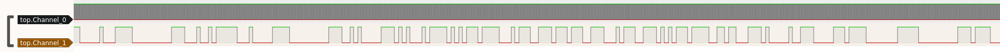
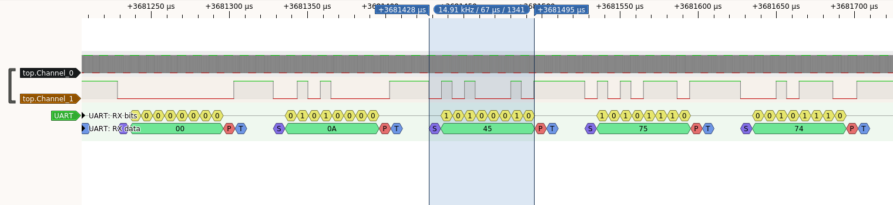
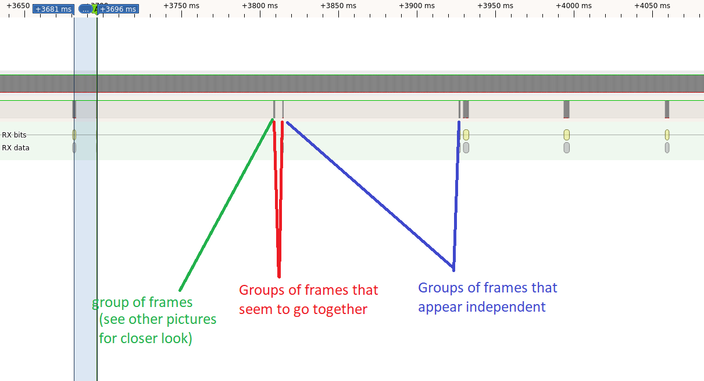
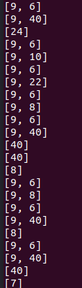

# write-up Smartboot1/2 - FCSC2022

This document present my resolution process for the smartboot1/2 challenge during the FCSC 2022 event. 
(4 resolutions)

# The challenge

As always in the FCSC the challenge comes with a movie-like plot. Here we got our hands on a device that secure the telecommunications with satellites. But it is protected and we can't brutforce the password to unlock it.All other options being discarded, we must resolve to analyze the communications in the only place that is not under an epoxy layer.That is between the processor and a secure component (that we can't attack).

The last part of the scenario contain a hint: The challenge/response part does not seem to be very exploitable. The second part change from one boot to another, but some patterns are still present.

**TLDR: We want to gather information by capturing the communications between the processor and a secure component during the boot sequence.**

With all that we are given two captures made between the secure component and the processor.

# Part 1 decode the capture

There is not a lot more to analyse in the challenge statement so i downloaded the two capture. They are in the vcd[1] format so pulseview should handle it just fine.

So I started Pulseview and... crash. Next time I won't forgot to reduce the sample rate, especially on an old pc with 4Gb of ram. So I reboot the computer and start again

The first signal seems to be the clock, the second one contain the informations. (the last two entry seems pointless for the challenge.)

After zooming in, we can distinguish 2 parts in the signal. The first part is identical between the two captures and had a lower baudrate. This didn't seem very interesting, and the hint given in the plot indicates me that I must not lose my time on that (at least for now).
The second one communicate far quicker and looked like this if we zoom enough:



After comparing with the same signal a little further I noticed a something. At some place the signal is always high like the end of an UART packet. That and the fact that the challenge statement spoke about UART give us the decoder to use: `UART`. \
Measuring the time between few High And lows give us a baudrate: 132000 (I don't remember it as a standard value but it's works well enough so I barely had to adjust the value.).
Finaly the periodical High we noticed earlier give us the "high end" of the UART signal and therefore the length of a frame: 8 + 1(parity) bits. For the parity I just tried to set the last one as a parity bit and it matched. 

I enter those parameter inside PulseView to get the bytes :


Now I exported the decoded data to a file. And I parsed it into python.
But before starting the second part I wanted to get the timing information. So I measure a threshold time of what looks like the time between frames in a same group, related groups of frames. And what look like completely separated groups of frames. (that wasn't mandatory, but it helped me get see the pattern faster in the next part). Here is an example:


I Load the result in python and parsed it to automatically regroup the frames that seem to go together.

# Part 2 Interpret the capture

Now come the hard part: interpreting the data. The goal is to deduce the protocol with little to no informations. I prefer python for this part as I can compare stuff with a simple line in the interpreter. Here we are **looking for patterns!**

First things to look for patterns the packets size. I managed to group the frames earlier, so I wanted to leverage that to get an overview. A quick print of the length of our groups gave me lots of informations! The values are the length of the groups of frames (in bytes).



This pattern seems to repeat clearly:
- A group of 9 bytes is sent and receive a response of 6 bytes.
- Then again a group of 9 bytes is sent and receive a response of X bytes that are slitted in multiples groups if exceed 40 bytes.

 
I my notes i gave those names:
- `cmd`: The groups of 9 bytes that are sent and that always initiates the exchange. So it looked like the command that is send to the secure component.
- `ack`: the response to the first `cmd`. It is always 6 bytes long
- `answer` the group of X bytes in response to the 2nd `cmd`. This it splitted to in chunk of max 40 bytes. 

We find the same pattern over and over again:
```
cmd1(9 bytes) => ack(6 bytes)
cmd2(9 bytes) => answer(Xbytes divided into chunk of max 40 bytes)
```

I looked at the `cmd1 => ack` part first so i printed only those data and again looked for patterns.
- `cmd1` is always `\x00@\x05\x00\xad` + 2 bytes + `\x00` + XORchecksum(1byte).
- `ack` isn't intresting seems to be almost always `\x00@\x02\x90\x00\xd2`. I though of it as an Acknowledge for the 1st part of the command. 

We only have one unknown (2 bytes) here. The rest of the data is predictable, so it shouldn't contain any informations (I had to make assumptions to avoid wasting time.).

After that I looked at the `cmd2 => answer` part. Again I printed them aside to compare them and just keep what changes:
- `cmd2` start with : `\x00\x00\x05\x00\xdd\x00` + 1 byte + `\x00` + XORchecksum(1byte).
- `answer` each chunk of 40 bytes seems organized like so:
- 1 byte : always `00`
- 1 byte : `00` if it is the last chunk of the answer, `20` if there is another one comming, `60` if there is two other chunks.
- 1 byte : always '00'
- 1 byte : length of the data in the packet (easy to deduce as it is the same for all th group of bytes that mesure the maximum length)
- **`DATA` N bytes**: the only things that seems to realy contain information.
- 4 bytes:that are only present if it isn't the last chunk. it is `00900090` there are 2 chunk are left. `00800080` when there is 1 chunk left. No important info in thoses bytes
To sum up after looking for patterns, we can eliminate what it fixed or predictable. I assumed that what is predictable didn't contain any informations. The actual information is stored in the 6th and 7th bytes of the first `cmd`, the 7th byte in the 2nd `cmd`, and the DATA in the `answer`.

Off course I checked if that data part was readable. I exported it in a file and looked at it with string and binwalk. But there was nothing interesting. Moreover the bytes in the `DATA` field of the answer looked very random. I though it was probably encrypted or encoded in a way. So I finally resigned to keep decoding the protocol.


I searched "bootloader" on google to get an idea of what a bootloader is supposed to do send. I found this https://www.st.com/resource/en/application_note/cd00264342-usart-protocol-used-in-the-stm32-bootloader-stmicroelectronics.pdf. It is a documentation for a bootloader over usart. When i was reading the table of content I had a click.

It contained a command named "Read Memory", it would be perfect to put a flag/file/program inside, and could match the patterns we found. I checked and the unknown byte in the 2nd `cmd` matched the length of the data sent back (-1). So this one says how much data to read (actually it was an offset, I made a 1 index error in my first export).\
I guessed the 2 bytes unknown were the address of the first byte to read.

Finally I run a script that would take all the `DATA` and put them at the address given by the 2 unknown bytes of the first `cmd`. and repeated that for every request in the capture.

After sending that into a file. A `file ./export_data.bin` command told me that it was a 7z compressed archive. And that was it !

Inside there was a file explaining the flag was the shasum of the 7z file!

# Side notes

I realy liked this challenge even if it didn't requiered a lot of knowledge other than UART, decoding a signal with PulseView. That's probably because it mostly test the ability to make deductions.\
It also learned my two things: 
- What bootloader chip commands look like.
- Never forget to add sample reduction in PulseView when the file is large. 

# Ressources

[1] 
[1] https://www.st.com/resource/en/application_note/cd00264342-usart-protocol-used-in-the-stm32-bootloader-stmicroelectronics.pdf \